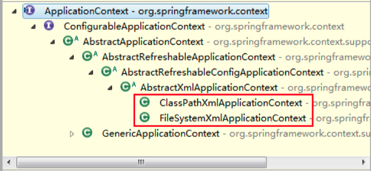

# 第一个spring项目


## 使用spring的作用：

1. spring作为容器管理对象， 开发人员从spring中获取要使用的对象。

## 实现步骤：

### 1.新建maven项目


### 2.加入依赖， 修改pom.xml

在Spring项目中，一共有四种依赖：

- 1）spring核心依赖
  spring-core、spring-beans、spring-context
- 2）spring dao依赖（提供JDBCTemplate）
  spring-jdbc、spring-tx
- 3）spring web依赖
  spring-web、spring-webmvc
- 4）spring test依赖
  spring-test
  可以根据需要，分别加入不同的依赖。
  本项目中，只需要使用spring-context上下文，因此只添加该依赖

```xml
    <!--spring依赖-->
    <dependency>
      <groupId>org.springframework</groupId>
      <artifactId>spring-context</artifactId>
      <version>5.2.5.RELEASE</version>
    </dependency>
```


### 3.开发人员定义类： 接口和实现类

  类也可以没有接口。
  接口和实现类定义：和没有spring一样。


### 4.创建spring的配置文件。 作用：声明对象。

在 src/main/resources/目录现创建一个 xml 文件，文件名可以随意，但 Spring 建议的名称为 applicationContext.xml。

把对象交给spring创建和管理。

spring 配置中需要加入约束文件才能正常使用，约束文件是 xsd 扩展名。

使用<bean>表示对象声明，一个bean表示一个java对象。

```xml
		<!--创建自定义对象-->
    <bean id="someService" class="com.sxl.springlearn.hello.service.impl.SomeServiceImpl" />
    <!--创建非自定义对象-->
    <bean id="mydate" class="java.util.Date" />
```


### 5.使用容器中的对象。

ApplicationContext 用于加载 Spring 的配置文件，在程序中充当“容 器”的角色。其实现类有两个。



- 若 Spring 配置文件存放在项目的类路径下，则使用 ClassPathXmlApplicationContext 实现类进行加载。
- 若 Spring 配置文件存放在其它的路径下，则使用 FileSystemXmlApplicationContext 实现类进行加载。

